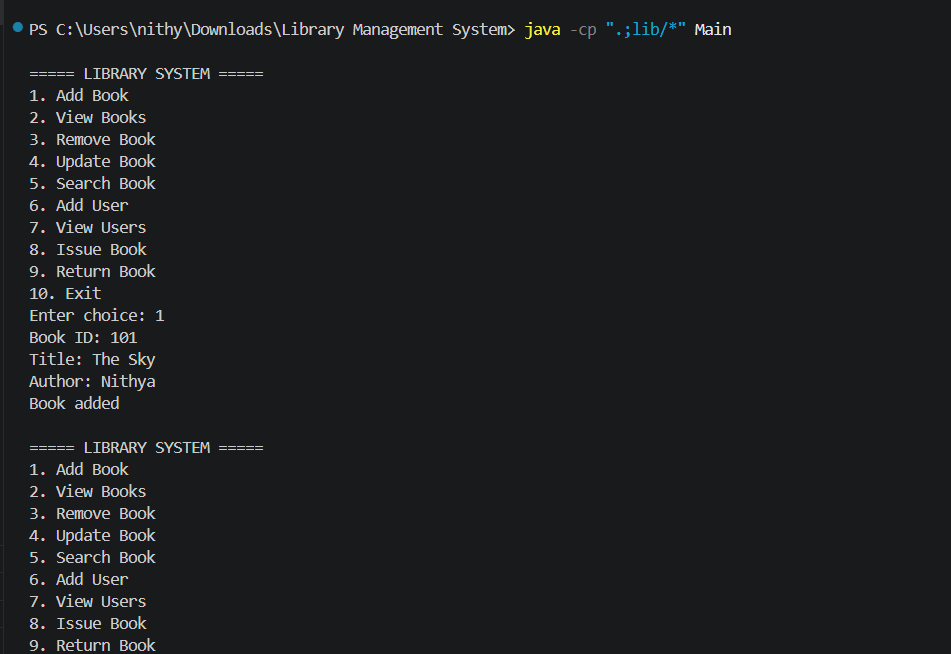
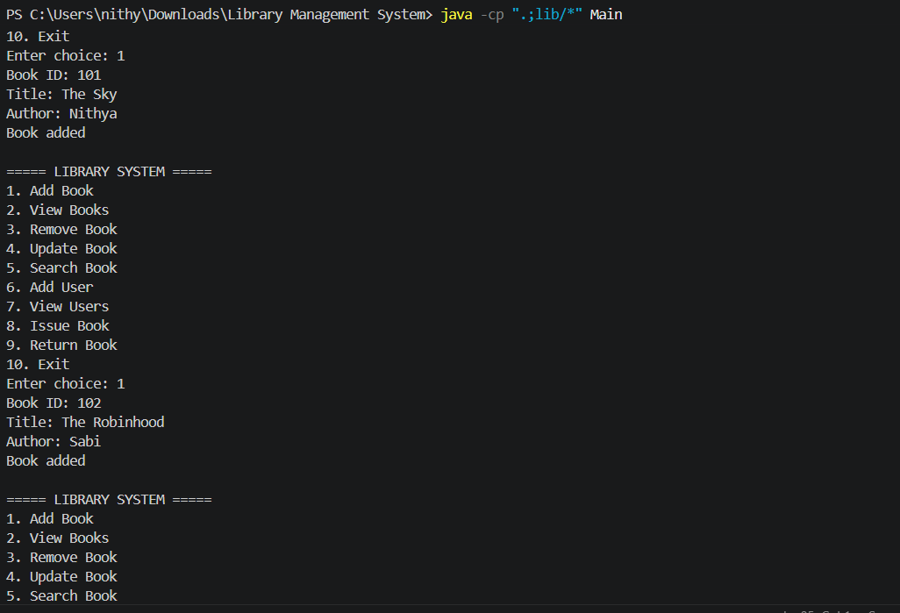
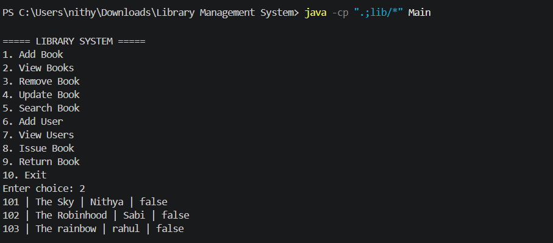
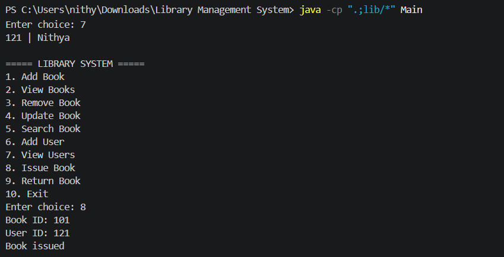
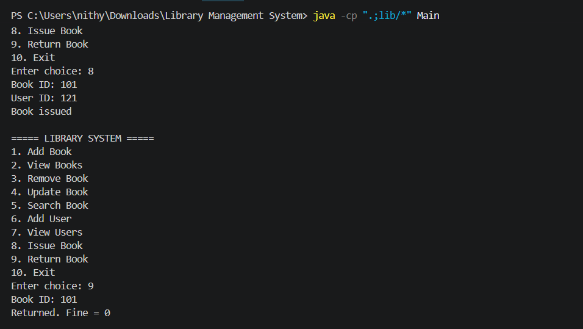
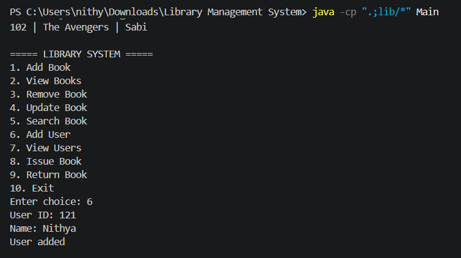

# Library Management System

## Project Overview
This is a Java-based Library Management System using MySQL and JDBC.  
It helps to manage books, users, and transactions like issue and return of books with fine calculation.

---

## Features
● Add Book  
● Remove Book  
● Update Book  
● View Books  
● Search Book by title/author  
● Add User  
● View Users  
● Issue Book  
● Return Book with fine calculation  

---

## Technology Used
● Java (OOP Concepts)  
● JDBC (Database Connectivity)  
● MySQL  
● VS Code / Eclipse  

---

## Database Setup
Import the file:
library_db.sql

Run it in MySQL Workbench to create database and tables.

---

## How to Run

### Step 1: Add MySQL Connector
Place jar file inside lib folder:
lib/mysql-connector-j-9.6.0.jar

---

### Step 2: Compile
javac -cp ".;lib/*" src/*.java

---

### Step 3: Run
java -cp ".;lib/*;src" Main

---

## Screenshots

● Main Menu  
screenshots/menu.png  

● Add Book  
screenshots/add_book.png  

● View Books  
screenshots/view_books.png  

● Issue Book  
screenshots/issue_book.png  

● Return Book  
screenshots/return_book.png  

● Add User  
screenshots/add_user.png  

---

## Output
The system successfully performs all library operations like book management, user management, and transaction tracking.

Main Menu Output:

Add Book Output:

View Books Output:

Issue Book Output:

Return Book Output (Fine Calculation):

Add User Output:

---

Conclusion

The project successfully performs all library management operations using Java and MySQL.

## Author
Nithyaisweriya