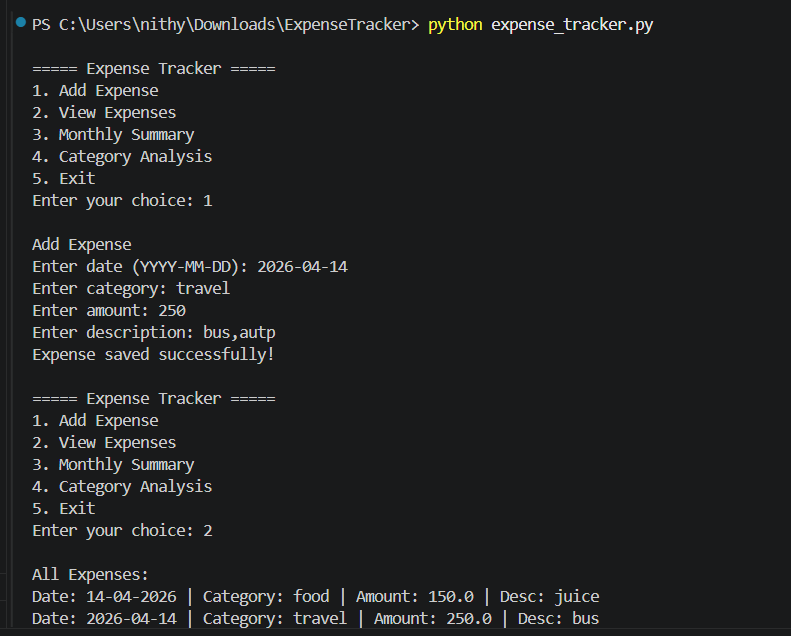

# Smart Expense Tracker with Insights

## Description

This project is a simple Expense Tracker developed using Python.
It helps to store daily expenses and view them later.
It also shows monthly total and category-wise spending.

## Features

* Add expense (date, category, amount, description)
* View all expenses
* Monthly summary
* Category analysis
* Highest spending category

## Technologies Used

* Python
* CSV file handling

## How to Run

1. Open the folder in VS Code
2. Run the file using:
   python expense_tracker.py
3. Enter the details and use menu options

## Sample Output

## Notes

* Date should be in format YYYY-MM-DD
* Do not use comma in description

## Future Improvements

* Add pie chart
* Add better validation
* Improve UI
