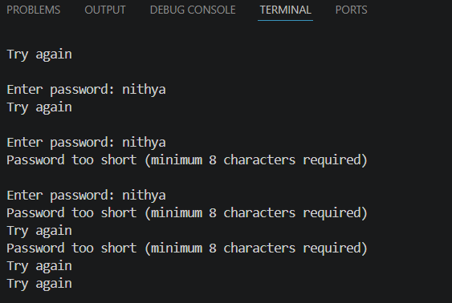
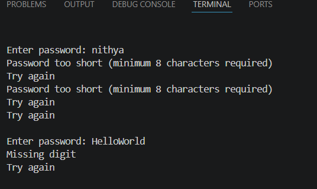
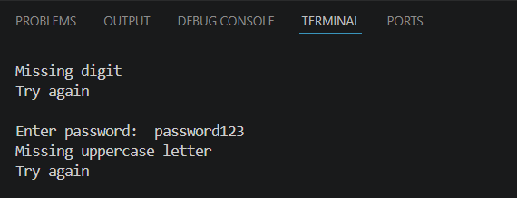
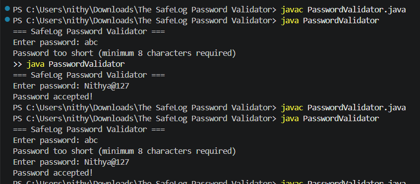

Password Validator Project
Project Description

This project is a simple Java program that checks whether a password entered by the user is strong or not. It validates the password based on basic rules like length, uppercase letter, and digit. If the password is not valid, it shows a specific message and asks the user to try again until a correct password is entered.

Tools Used
Java
VS Code / Eclipse
Scanner class
Password Rules
Password must be at least 8 characters long
It must contain at least one uppercase letter
It must contain at least one digit (0-9)
Working Process

The program takes input from the user and checks each condition one by one. If any rule is not satisfied, it displays the exact reason for failure. The process repeats until the user enters a valid password.

Sample Output
Case 1: Too short password

Input:

abc

Output:

Case 2: Missing digit

Input:

HelloWorld

Output:

Case 3: Missing uppercase letter

Input:

java1234

Output:

Case 4: Correct password

Input:

Hello123

Output:

Conclusion

This project helps in understanding basic programming concepts like loops, conditions, and string handling in Java. It also improves logic building by validating user input step by step and giving proper feedback.